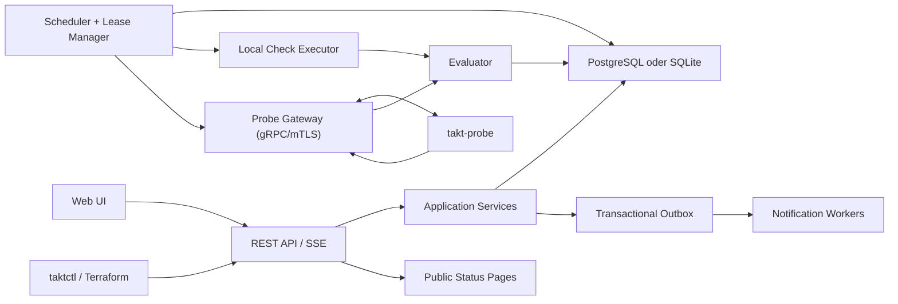

# 01 – Architektur

## 1. Architekturentscheidung

Takt beginnt als **modularer Monolith** mit klar getrennten Domänenmodulen. Zusätzlich existiert das separat ausführbare `takt-probe`. Diese Form minimiert Betriebsaufwand, erhält aber saubere Grenzen für spätere Skalierung.



## 2. Technologiestack

### 2.1 Backend

- Rust stable, durch `rust-toolchain.toml` gepinnt
- Tokio als asynchrone Laufzeit
- Axum und Tower für HTTP und Middleware
- Serde für Verträge
- SQLx mit compile-time checked queries für PostgreSQL und SQLite
- Reqwest mit rustls für HTTP-Prüfungen
- Hickory DNS für DNS-Prüfungen
- Tonic/Prost für Probe-gRPC
- `tracing`, OpenTelemetry und Prometheus-Metriken für Beobachtbarkeit
- Utoipa oder ein gleichwertiger Ansatz zur Ableitung und Prüfung des OpenAPI-Vertrags
- Clap für `takt-server`, `takt-probe` und `taktctl`

Rust ist hier optimal, weil Check-Ausführung, Scheduler und Probe viele parallele Netzwerkoperationen mit geringem Speicherbedarf und robustem Fehlerhandling benötigen. Rust DARF jedoch nicht zu eigenentwickelten Protokollen oder unnötiger Abstraktion führen.

### 2.2 Frontend

- React mit TypeScript `strict`
- Vite
- TanStack Query für Serverzustand
- React Router
- Formbibliothek mit Schema-Validierung
- Zugängliche Headless-Komponenten statt proprietärer Komplettbibliothek
- Playwright für Browser-Abnahme

Die UI wird separat gebaut und als versionierte statische Assets in `takt-server` eingebettet. Für Entwicklungsbetrieb DARF sie über einen lokalen Dev-Server laufen.

### 2.3 Datenhaltung

- PostgreSQL 16+ ist das Produktionssystem.
- SQLite 3 ist für Einzelinstanz, Evaluation und kleine Home-Labs zulässig.
- Fachliche Semantik MUSS auf beiden Engines gleich sein.
- Features, die in SQLite nicht sicher abbildbar sind, MÜSSEN mit einer klaren Kapazitätsgrenze dokumentiert werden; keine stille Verschlechterung.
- MySQL und MariaDB gehören nicht zum Umfang bis 0.3.

## 3. Repository-Struktur

```text
takt/
├── Cargo.toml
├── rust-toolchain.toml
├── crates/
│   ├── domain/             # reine Fachtypen und Zustandsautomaten
│   ├── application/        # Use Cases, Ports, Transaktionen
│   ├── persistence/        # SQLx-Repositories und Migrationen
│   ├── api/                # REST, SSE, Auth-Middleware
│   ├── scheduler/          # Planung, Leases, Dispatch
│   ├── checks/             # typisierte Check-Implementierungen
│   ├── notifications/      # Outbox und Kanaladapter
│   ├── probe-protocol/     # erzeugte und manuelle Protokolltypen
│   ├── server/             # Composition Root / Binary
│   ├── probe/              # Remote-Probe / Binary
│   └── taktctl/            # CLI / Binary
├── web/                    # React-Anwendung
├── contracts/              # OpenAPI, JSON Schema, Proto
├── migrations/
│   ├── postgres/
│   └── sqlite/
├── tests/
│   ├── contract/
│   ├── integration/
│   ├── e2e/
│   └── load/
├── docs/
└── deploy/
```

Zyklische Abhängigkeiten zwischen Crates sind verboten. `domain` DARF weder Datenbank-, Web- noch Laufzeitframeworks importieren.

## 4. Module und Verantwortungen

### Domain

Enthält IDs, Monitor-Spezifikationen, Observationen, Evaluationen, Alert-State-Machine, Uptime-Berechnung und Berechtigungsentscheidungen. Keine I/O-Aufrufe.

### Application

Orchestriert Use Cases über explizite Ports. Definiert Transaktionsgrenzen. Nimmt authentifizierten Actor und Request-Kontext entgegen.

### Persistence

Implementiert Repositories, Migrationen, Outbox und Lease-Operationen. Datenbankfehler werden in typisierte Infrastrukturfehler übersetzt und nie als Check-Ergebnis ausgegeben.

### API

Validiert externe Eingaben, führt Authentifizierung und Autorisierung aus, ruft Application Services auf und serialisiert Problem Details. Die API enthält keine Fachlogik.

### Scheduler

Erzeugt fällige Check-Jobs, vergibt zeitlich beschränkte Leases und behandelt verspätete oder doppelte Ergebnisse idempotent. Der Scheduler führt keine fachliche Statusauswertung durch.

### Check Executor

Führt genau einen typisierten Check innerhalb eines Budgets aus und liefert eine Observation. DNS-Auflösung, Verbindungszeit, TLS, Request und Body-Lesen erhalten getrennte Zeitbudgets.

### Evaluator

Ordnet Observationen anhand der Monitorrevision ein, aktualisiert den Monitorzustand und schreibt Outbox-Ereignisse in derselben Datenbanktransaktion.

### Notification Worker

Liest Outbox-Ereignisse, rendert Templates, versendet über Adapter und speichert Versuche. Ein defekter Kanal blockiert weder Evaluierung noch andere Kanäle.

### Public Status

Liest ausschließlich freigegebene Projektionen. Die öffentlichen Endpunkte greifen nicht auf interne Monitorobjekte mit Geheimnissen oder Zielmetadaten zu.

## 5. Ausführungsfluss

1. Scheduler reserviert eine fällige Ausführung mit `job_id`, `monitor_revision_id`, Deadline und Lease.
2. Ein lokaler Executor oder eine Remote-Probe akzeptiert den Job.
3. Executor liefert eine unveränderliche Observation mit Zeitpunkten und klassifiziertem Ausführungsfehler.
4. Ingest prüft Signatur/Identität, Job, Revision, Deadline und Idempotenz.
5. Evaluator erzeugt eine Evaluation und berechnet den neuen Zustand.
6. Evaluation, Monitorzustand, Uptime-Buckets und Outbox-Events werden atomar gespeichert.
7. Notification Worker versenden fällige Events unabhängig.
8. SSE informiert eingeloggte Oberflächen über eine neue Ressourcenrevision.

## 6. Nebenläufigkeit und Idempotenz

- Jobs, Observationen und Outbox-Events besitzen UUIDv7-IDs.
- `(job_id, probe_id, attempt)` ist eindeutig.
- Ein verspätetes Ergebnis DARF gespeichert, aber nicht zwingend für den aktuellen Zustand verwendet werden.
- Zustandsänderungen verwenden optimistische Versionierung.
- Scheduler-Leases werden in der Datenbank atomar erworben und erneuert.
- API-Idempotency Keys gelten pro Actor, Methode und Pfad für 24 Stunden.
- Notification Worker verwenden `event_id + channel_id` als Deduplizierungsschlüssel.

## 7. Fehlerklassen

| Klasse | Beispiel | Fachliche Wirkung |
|---|---|---|
| Target failure | Timeout zum Ziel, falscher Statuscode | gemäß Monitorregel `DOWN` oder `DEGRADED` |
| Probe failure | Probe offline, lokale Ressourcen erschöpft | Standort `UNKNOWN`; Quorum neu bewerten |
| Takt infrastructure | DB nicht erreichbar, interne Panic | Systemfehler; niemals automatisch Target `DOWN` |
| Invalid configuration | ungültige Assertion, fehlendes Secret | Monitor `PAUSED` oder `UNKNOWN`; sichtbarer Konfigurationsfehler |
| Cancelled/superseded | Revision geändert, Job abgebrochen | keine Statusverschlechterung |

Rust-Panics DÜRFEN keine normale Fehlerbehandlung sein. Jeder Task MUSS an seiner Prozessgrenze isoliert werden; eine Panic erzeugt Telemetrie und einen internen Fehler.

## 8. Live-Aktualisierung

- REST ist die Quelle für Ressourcenzustände.
- SSE meldet nur Änderungen und kleine Live-Ereignisse; Clients laden bei Lücken neu.
- Jeder SSE-Event enthält `event_id`, `type`, `resource_id`, `resource_version` und `occurred_at`.
- Der Server MUSS Wiederaufnahme per `Last-Event-ID` innerhalb eines begrenzten Puffers unterstützen.
- Verwaltungsbefehle über WebSocket oder SSE sind verboten.

## 9. Erweiterbarkeit

Bis 0.3 werden Check- und Notification-Typen im Repository kompiliert. Jeder Typ implementiert einen internen, typisierten Vertrag und stellt Validierung, redigierte Darstellung, Laufzeitbudget und Tests bereit.

Ein experimenteller WASM-Vertrag KANN in 0.3 als deaktivierte Vorschau existieren, gehört aber nicht zu den Release-Muss-Kriterien. Dynamisch geladene native Bibliotheken und ungeprüfte Skripte sind verboten.

## 10. Verbotene Architekturabkürzungen

- Ein globales, untypisiertes Optionsobjekt für alle Monitorarten
- Fachlogik in HTTP-Handlern oder React-Komponenten
- Direkte Datenbankzugriffe aus Check- oder Notification-Adaptern
- Benachrichtigungsversand innerhalb der Auswertungstransaktion
- Versteckte API-Endpunkte nur für die eigene UI
- Datenbankspezifische Fachlogik ohne gemeinsamen Vertragstest
- Neue Services oder Broker ohne gemessenen Engpass und Architecture Decision Record
- Speicherung von Klartext-Secrets in Monitor-, Audit- oder Eventtabellen
