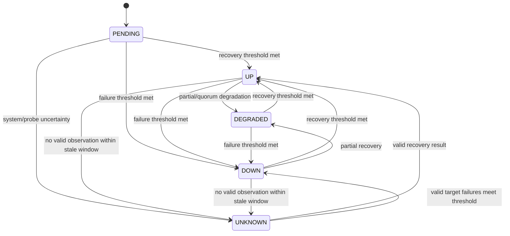

# 02 – Domäne und Datenhaltung

## 1. Mandantenmodell

```text
Organization
└── Project
    ├── Monitors
    ├── Notification Channels
    ├── Status Pages
    ├── Maintenances
    ├── Incidents
    └── Probe Assignments
```

0.1 kann intern eine automatisch erzeugte `default`-Organisation und ein `default`-Projekt verwenden. IDs und Autorisierungsgrenzen MÜSSEN trotzdem ab der ersten Migration vorhanden sein, damit 0.3 kein Mandanten-Retrofit erfordert.

## 2. Identität und Zeit

- Öffentliche Entitäts-IDs sind UUIDv7 und unveränderlich.
- Jede benennbare Projektressource besitzt zusätzlich einen normalisierten `slug`.
- Zeitpunkte sind UTC mit Mikrosekundenpräzision.
- Dauern werden in Millisekunden gespeichert und in API-Verträgen als Integer mit Einheit benannt.
- Jede änderbare Ressource besitzt `created_at`, `updated_at` und eine monoton steigende `version`.
- Löschung ist standardmäßig hart, wenn keine fachliche Historie betroffen ist. Audit- und Messdaten verwenden Aufbewahrungsregeln statt unbefristetem Soft Delete.

## 3. Zentrale Entitäten

### Organization

`id`, `slug`, `name`, `settings`, `created_at`, `updated_at`, `version`

### Project

`id`, `organization_id`, `slug`, `name`, `default_timezone`, `created_at`, `updated_at`, `version`

### Monitor

Gemeinsame Felder:

- `id`, `project_id`, `slug`, `name`, `description`
- `kind`
- `enabled`
- `schedule_interval_ms`, `timeout_ms`, `jitter_percent`
- `failure_threshold`, `recovery_threshold`
- `probe_policy`, `probe_selector`
- `current_revision_id`, `current_state`, `state_since`
- `managed_by`, `managed_source`
- `created_at`, `updated_at`, `version`

Monitorartspezifische Daten liegen als versioniertes JSONB/JSON-Dokument in `monitor_revisions.spec`. Dieses Dokument MUSS gegen das typisierte Rust-Modell validiert werden. Häufig gefilterte oder referenzielle Felder DÜRFEN nicht ausschließlich in JSON liegen.

### MonitorRevision

Unveränderlicher Snapshot der vollständigen Prüfspezifikation mit `id`, `monitor_id`, `revision_number`, `spec`, `spec_hash`, `created_by`, `created_at`.

### Probe

`id`, `organization_id`, `slug`, `display_name`, `labels`, `status`, `last_seen_at`, `certificate_fingerprint`, `version`, Zeitstempel.

### CheckJob

`id`, `monitor_id`, `monitor_revision_id`, `probe_id`, `scheduled_for`, `not_before`, `deadline`, `attempt`, `lease_owner`, `lease_until`, `status`.

### Observation

Unveränderliches Rohresultat:

- `id`, `job_id`, `probe_id`, `monitor_revision_id`
- `started_at`, `finished_at`, `duration_ms`
- `outcome`: `SUCCESS`, `TARGET_FAILURE`, `PROBE_FAILURE`, `CANCELLED`
- `error_code`, `summary`
- typisierte, redigierte `details`
- `received_at`, `late`

Response-Bodies werden standardmäßig nicht gespeichert. Für Assertions notwendige Ausschnitte DÜRFEN höchstens 4 KiB und nur redigiert gespeichert werden.

### Evaluation

`id`, `observation_id`, `monitor_id`, `state`, `reason_code`, `reason_summary`, `effective_at`, `ruleset_hash`, `created_at`.

### MonitorStateTransition

`id`, `monitor_id`, `from_state`, `to_state`, `evaluation_id`, `occurred_at`. Nur echte Zustandswechsel erzeugen Einträge.

### NotificationChannel

`id`, `project_id`, `slug`, `kind`, nicht geheime `config`, `secret_ref`, `enabled`, `version`, Zeitstempel.

### OutboxEvent und DeliveryAttempt

Outbox-Event: stabiler Typ, Payload-Version, Aggregat-ID, Auftretenszeit und Status. DeliveryAttempt: Kanal, Versuch, Antwortklasse, redigierte Fehlermeldung und nächster Versuch.

### StatusPage und StatusPageComponent

StatusPage enthält Branding, Sichtbarkeit und Locale. Components referenzieren Monitore oder manuelle Komponenten; sie kopieren keine internen Zielwerte.

### Incident und IncidentUpdate

Incident besitzt Status `INVESTIGATING`, `IDENTIFIED`, `MONITORING`, `RESOLVED`, Auswirkung und betroffene Komponenten. Updates sind unveränderlich.

### Maintenance

Einmaliger oder wiederkehrender Zeitraum mit Zeitzone, Zielselektor und Verhalten `SUPPRESS_NOTIFICATIONS` oder `MARK_MAINTENANCE`.

### AuditEvent

`id`, `organization_id`, `project_id`, `actor_type`, `actor_id`, `action`, `resource_type`, `resource_id`, `request_id`, `source_ip_hash`, `before_hash`, `after_hash`, `metadata`, `occurred_at`.

Audit-Metadaten DÜRFEN keine Secrets oder vollständigen sensiblen Zielwerte enthalten.

## 4. Monitorzustandsautomat



`PAUSED` und `MAINTENANCE` sind überlagernde Betriebszustände. Beim Verlassen wird der fachliche Zustand aus neuen oder noch gültigen Evaluationen bestimmt; ein alter Zustand darf nicht blind wiederhergestellt werden.

### Zustandsregeln

- Nur `TARGET_FAILURE` zählt gegen `failure_threshold`.
- `PROBE_FAILURE`, interne Fehler und ausbleibende Ergebnisse führen nach `stale_after` zu `UNKNOWN`.
- `SUCCESS` zählt gegen `recovery_threshold`.
- Bei Multi-Probe-Monitoren wird zuerst pro Probe, dann über die Probe Policy bewertet.
- `quorum` verlangt eine explizite Mindestzahl. Nicht verfügbare Probes zählen nicht als Target-Ausfall, können aber verhindern, dass ein Quorum erreicht wird; Ergebnis ist dann `UNKNOWN`.
- Flapping liegt vor, wenn mindestens vier echte Wechsel in zehn Auswertungsfenstern auftreten. Benachrichtigungen werden gedrosselt, der sichtbare Zustand bleibt wahrheitsgemäß.

## 5. Uptime-Berechnung

Uptime basiert auf Zeitanteilen, nicht auf der bloßen Anzahl von Heartbeats.

- `UP` zählt als verfügbar.
- `DEGRADED` zählt standardmäßig als verfügbar, wird aber separat ausgewiesen.
- `DOWN` zählt als nicht verfügbar.
- `UNKNOWN`, `PAUSED` und geplante `MAINTENANCE` werden aus dem Nenner ausgeschlossen.
- Statusseiten KÖNNEN Wartung separat anzeigen, DÜRFEN sie aber nicht als Ausfall zählen.
- Zustandsintervalle werden aus Transitionen rekonstruiert und in Rollup-Buckets verdichtet.

Die API liefert `uptime_ratio`, `degraded_ratio`, `excluded_ratio` und die zugrunde liegende Dauer. Ein einzelner Prozentwert ohne Nenner ist unzulässig.

## 6. Aufbewahrung und Verdichtung

Standardwerte:

| Daten | PostgreSQL | SQLite |
|---|---:|---:|
| Detail-Observationen | 30 Tage | 7 Tage |
| 1-Minuten-Rollups | 90 Tage | 30 Tage |
| 1-Stunden-Rollups | 24 Monate | 12 Monate |
| Zustandswechsel | 24 Monate | 12 Monate |
| Delivery Attempts | 30 Tage | 14 Tage |
| Audit Events | 12 Monate | 6 Monate |
| Incidents | unbegrenzt bis Löschung | unbegrenzt bis Löschung |

PostgreSQL partitioniert Observationen monatlich nach `started_at`. Ein Retention Worker löscht in begrenzten Batches oder entfernt ganze Partitionen. SQLite führt begrenzte Batch-Löschungen und kontrollierte Vacuum-Operationen aus.

## 7. Migrationen

- Migrationen sind vorwärtsgerichtet, nummeriert und unveränderlich nach Release.
- Jede Migration läuft transaktional, sofern die Engine dies erlaubt.
- Serverstart verweigert unbekannte neuere Schema-Versionen.
- Automatische Migration ist im Einzelbetrieb Standard; Produktion kann `--migrate-only` und `--no-auto-migrate` verwenden.
- Jede Release-Migration wird auf einer Kopie der größten unterstützten Vorgängerdatenbank getestet.
- Destruktive Schemaänderungen verwenden Expand/Migrate/Contract über mindestens zwei Minor-Releases.
- Backup und Restore sind die Rollback-Strategie; es gibt keine fingierten Down-Migrationen für irreversible Datenänderungen.

## 8. Geheimnisse

Geheimnisse werden in einer separaten Tabelle als verschlüsselte, versionierte Blobs gespeichert:

- Envelope Encryption mit AES-256-GCM oder ChaCha20-Poly1305
- zufälliger Nonce pro Secret-Version
- Associated Data bindet Organisation, Secret-ID und Version
- Master Key aus Datei, Umgebungs-Secret oder externem Secret Provider; nie aus der Datenbank
- API-Antworten liefern nur `configured: true` und optional die letzten vier unkritischen Zeichen
- Secret-Änderungen sind revisioniert, alte Werte werden nach einer kurzen Rollback-Frist sicher verworfen

## 9. Datenbank-Indizes und Grenzen

Mindestens erforderlich:

- eindeutige Slugs pro `(project_id, resource_type)`
- fällige Jobs nach `(status, not_before)`
- aktive Leases nach `lease_until`
- Observationen nach `(monitor_id, started_at desc)`
- Zustandswechsel nach `(monitor_id, occurred_at desc)`
- Outbox nach `(status, next_attempt_at)`
- Audit nach `(organization_id, occurred_at desc)`

N+1-Abfragen in Listenendpunkten sind ein Release-Blocker. Alle Listen besitzen harte Seitengrößen; maximal 200, Standard 50.
